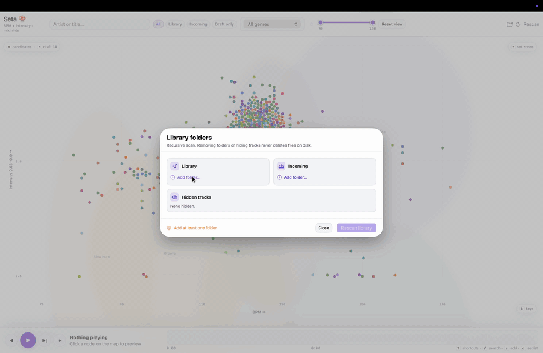
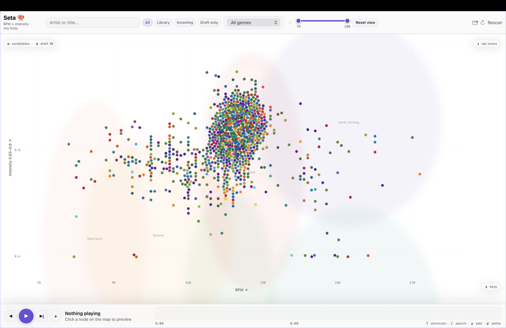

# SetaMac

Local-first macOS app for building DJ set drafts from a map of your library.

Start from a seed track, explore smart candidates and bridge routes, repair weak links, then export the draft to Rekordbox or another DJ tool. Seta keeps the early creative phase map-first, so you can shape a set journey before committing to a fixed playlist order.

**[Download & install](docs/DOWNLOAD.md)** · [Releases](https://github.com/manupastorr/seta-mac/releases) · License: [MIT](LICENSE)

## Quick install

1. Download `SetaMac-0.3.9-macos14.zip` from [Releases](https://github.com/manupastorr/seta-mac/releases).
2. Unzip it and move **SetaMac.app** to Applications.
3. **Open it:** right-click **SetaMac.app** → **Open** → **Open**.  
   macOS says **“damaged”**? Click **Cancel**, then follow [these steps](docs/DOWNLOAD.md#if-macos-blocks-the-app) (one Terminal line).
4. **In the app:** click **Start setup** and wait (internet once).
5. Add music folders in **Library → Library Folders…**, then click **Rescan library**. Tracks appear in batches while analysis continues.

More detail: **[docs/DOWNLOAD.md](docs/DOWNLOAD.md)**

## Notes

- Bundled scanner analyzes folders you choose; SetaMac does not move or rename your files.
- During a scan, SetaMac shows analyzed tracks as partial results; the completed `library.json` is written at the end.
- Manual BPM/key/energy overrides stay in local app settings.
- Removing a folder or track inside SetaMac does not delete audio files.

## Development

- Swift app code lives in `Sources/`.
- The production Python scanner lives in `Scanner/` and is bundled directly into releases.
- Generated scanner files such as `library.json`, `cache.json`, and `scan-progress.json` stay local and are not bundled.
