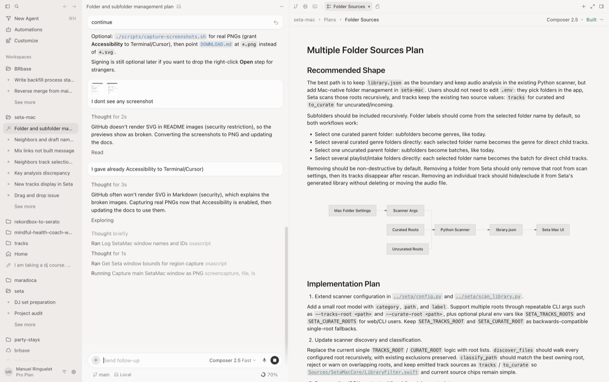

# SetaMac

Native macOS app for Seta — browse your library on a **BPM × energy** map with Camelot mix hints and playback.

**[Download & install](docs/DOWNLOAD.md)** · [Releases](https://github.com/manupastorr/seta-mac/releases) · Scanner: [seta](https://github.com/manupastorr/seta) · License: [MIT](LICENSE)

## Quick install

1. Download `SetaMac-*-macos14.zip` from [Releases](https://github.com/manupastorr/seta-mac/releases).
2. Unzip → move **SetaMac.app** to Applications → **right-click → Open** the first time.
3. Clone [seta](https://github.com/manupastorr/seta) and run `./start.sh` once (needed for **Rescan**).
4. In the app: **Library → Library Folders…** → add folders → **Rescan library**.



Details and screenshots: **[docs/DOWNLOAD.md](docs/DOWNLOAD.md)**.

## Versioning

- App version: `VERSION` (also in the app bundle and release zip name).
- Changelog: [CHANGELOG.md](CHANGELOG.md).

```bash
# Maintainer: bump VERSION, update CHANGELOG, then:
./scripts/make-release.sh
gh release create v0.2.0 dist/SetaMac-0.2.0-macos14.zip --title "SetaMac 0.2.0" --notes "See CHANGELOG.md"
```

## Develop

```bash
./scripts/verify-all.sh
./scripts/run.sh
open dist/SetaMac.app
```

Optional signing: `./scripts/sign-app.sh` and `./scripts/notarize-app.sh` (Apple Developer account).

## Notes

- Reads `library.json` from the Python scanner; does not move or rename your files.
- Manual BPM/key/energy overrides stay in local app settings, not in `library.json`.
