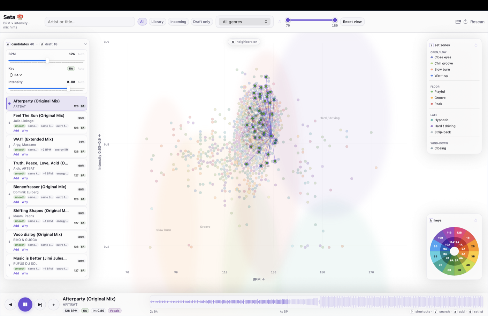

# Download SetaMac

Local-first macOS app for building DJ set drafts from a map of your library. Start with one track, explore smart candidates and bridges, then export a draft to Rekordbox or another DJ tool. It works with folders on your Mac; nothing is uploaded.

**Latest release:** [SetaMac 0.3.5](https://github.com/manupastorr/seta-mac/releases/tag/v0.3.5) — download `SetaMac-0.3.5-macos14.zip`.

| Requirement | Detail |
|-------------|--------|
| macOS | 14+ |
| Internet | Once, during first-time setup |
| Music files | `.wav`, `.aiff`, `.flac`, `.mp3` in folders you add |


## Before you start

- Have your music already in folders on your Mac.
- Allow about 10 minutes for the first launch.
- macOS may block the first open — or say **“damaged”** — because SetaMac is not from the App Store yet. That is normal; see [If macOS blocks the app](#if-macos-blocks-the-app).

## Install

1. Download `SetaMac-0.3.5-macos14.zip` from [Releases](https://github.com/manupastorr/seta-mac/releases/tag/v0.3.5).
2. Unzip and move **SetaMac.app** to Applications.
3. **First launch:** right-click **SetaMac.app** → **Open** → **Open**.  
   If macOS says **“damaged”**, see [If macOS blocks the app](#if-macos-blocks-the-app).
4. In SetaMac, click **Start setup** when asked. Keep the app open until setup finishes (a few minutes; internet required once).
5. Click **Continue**, then add your music folders in **Library → Library Folders…**.
6. Click **Rescan library**. This creates the library file and fills the map.

Removing a folder or track in SetaMac does **not** delete your audio files.

## Troubleshooting

**Setup failed** → check internet, click **Try again**.  
**Empty map** → finish setup, add folders, click **Rescan library**.

### If macOS blocks the app

Normal for apps outside the App Store. The app is not broken.

**Step 1 — try this**

1. Click **Cancel** (not Move to Trash).
2. Right-click **SetaMac.app** → **Open** → **Open**.

**Step 2 — if it still says “damaged”**

1. Open **Terminal:** press **⌘ Space**, type `Terminal`, press **Return**.
2. Paste this, then press **Return**:

```bash
xattr -cr /Applications/SetaMac.app
```

3. Open SetaMac again.

Still in Downloads? Use:

```bash
xattr -cr ~/Downloads/SetaMac.app
```

## Developer install (optional)

If you prefer the standalone Python scanner repo instead of the in-app setup:

```bash
git clone https://github.com/manupastorr/seta.git
cd seta
./start.sh
```

Keep the scanner repo anywhere you like and point SetaMac at it only if you configure that path explicitly after the first scan.

## Screenshots

| Set journey map | Mix candidates |
|--------------|----------------|
|  |  |

## License

MIT — see [LICENSE](../LICENSE).
